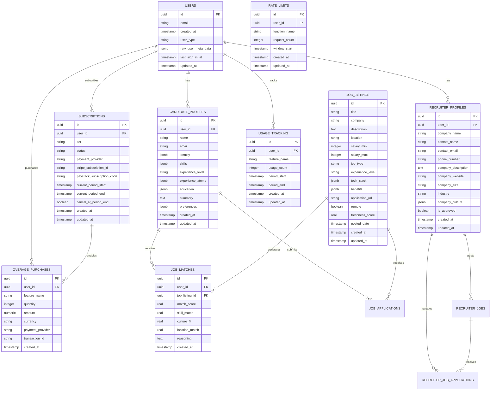

# 🗄️ Hunter AI - Database Schema Documentation

**Version**: 2.0.0
**Database**: PostgreSQL 15 (Supabase)
**Last Updated**: 2026-03-19

---

## 📋 Table of Contents

1. [Schema Overview](#schema-overview)
2. [Core Tables](#core-tables)
3. [Relationships](#relationships)
4. [Indexes](#indexes)
5. [Functions](#functions)
6. [Row-Level Security](#row-level-security)
7. [Migrations](#migrations)
8. [Performance Optimizations](#performance-optimizations)

---

## 🏗️ Schema Overview

Hunter AI uses a PostgreSQL database with Row-Level Security (RLS) for multi-tenant data isolation. The schema supports candidates, recruiters, and administrators with comprehensive audit trails and performance optimizations.

### Entity Relationship Diagram



---

## 📊 Core Tables

### 1. Users (auth.users)

Managed by Supabase Auth, extended with custom metadata.

```sql
-- Supabase managed table
-- Custom fields in raw_user_meta_data:
{
  "user_type": "candidate" | "recruiter" | "admin",
  "onboarding_completed": boolean,
  "terms_accepted_at": "2026-03-19T18:30:00Z"
}
```

### 2. candidate_profiles

```sql
CREATE TABLE candidate_profiles (
    id UUID DEFAULT gen_random_uuid() PRIMARY KEY,
    user_id UUID REFERENCES auth.users(id) ON DELETE CASCADE,
    name TEXT,
    email TEXT,
    identity JSONB DEFAULT '{}',
    skills JSONB DEFAULT '[]',
    experience_level TEXT,
    experience_atoms JSONB DEFAULT '[]',
    education JSONB DEFAULT '[]',
    summary TEXT,
    preferences JSONB DEFAULT '{}',
    created_at TIMESTAMP WITH TIME ZONE DEFAULT NOW(),
    updated_at TIMESTAMP WITH TIME ZONE DEFAULT NOW()
);

-- Sample data structure
{
  "identity": {
    "name": "John Doe",
    "phone": "+1234567890",
    "location": "San Francisco, CA",
    "website": "https://johndoe.dev",
    "linkedin": "https://linkedin.com/in/johndoe"
  },
  "skills": [
    {
      "name": "React",
      "level": "expert",
      "years": 5
    },
    {
      "name": "TypeScript",
      "level": "advanced",
      "years": 3
    }
  ],
  "experience_atoms": [
    {
      "company": "TechCorp Inc.",
      "role": "Senior React Developer",
      "duration": "2022-2025",
      "location": "Remote",
      "description": "Built scalable web applications...",
      "technologies": ["React", "TypeScript", "Node.js"]
    }
  ],
  "education": [
    {
      "institution": "University of Technology",
      "degree": "BS Computer Science",
      "year": "2020",
      "gpa": "3.8"
    }
  ],
  "preferences": {
    "target_roles": ["React Developer", "Frontend Engineer"],
    "locations": ["San Francisco", "Remote"],
    "salary_min": 100000,
    "salary_max": 200000,
    "remote_policy": "remote_only",
    "company_sizes": ["startup", "mid_size"],
    "industries": ["technology", "fintech"]
  }
}
```

### 3. recruiter_profiles

```sql
CREATE TABLE recruiter_profiles (
    id UUID DEFAULT gen_random_uuid() PRIMARY KEY,
    user_id UUID REFERENCES auth.users(id) ON DELETE CASCADE,
    company_name TEXT NOT NULL,
    contact_name TEXT NOT NULL,
    contact_email TEXT NOT NULL,
    phone_number TEXT,
    company_description TEXT,
    company_website TEXT,
    company_size TEXT,
    industry TEXT,
    company_culture JSONB DEFAULT '{}',
    is_approved BOOLEAN DEFAULT FALSE,
    created_at TIMESTAMP WITH TIME ZONE DEFAULT NOW(),
    updated_at TIMESTAMP WITH TIME ZONE DEFAULT NOW()
);

-- Sample company_culture structure
{
  "values": ["Innovation", "Collaboration", "Growth"],
  "work_environment": "hybrid",
  "team_size": "50-100",
  "tech_stack": ["React", "Node.js", "PostgreSQL"],
  "perks": ["Health insurance", "Flexible hours", "Remote work"]
}
```

### 4. job_listings

```sql
CREATE TABLE job_listings (
    id UUID DEFAULT gen_random_uuid() PRIMARY KEY,
    title TEXT NOT NULL,
    company TEXT NOT NULL,
    description TEXT,
    location TEXT,
    salary_min INTEGER,
    salary_max INTEGER,
    job_type TEXT DEFAULT 'full-time',
    experience_level TEXT DEFAULT 'mid',
    tech_stack JSONB DEFAULT '[]',
    benefits JSONB DEFAULT '[]',
    application_url TEXT,
    remote BOOLEAN DEFAULT FALSE,
    freshness_score REAL DEFAULT 1.0,
    posted_date TIMESTAMP WITH TIME ZONE DEFAULT NOW(),
    created_at TIMESTAMP WITH TIME ZONE DEFAULT NOW(),
    updated_at TIMESTAMP WITH TIME ZONE DEFAULT NOW()
);

-- Sample tech_stack and benefits
{
  "tech_stack": [
    {
      "category": "frontend",
      "technologies": ["React", "TypeScript", "Tailwind CSS"]
    },
    {
      "category": "backend",
      "technologies": ["Node.js", "PostgreSQL", "Redis"]
    }
  ],
  "benefits": [
    {
      "category": "health",
      "items": ["Medical insurance", "Dental", "Vision"]
    },
    {
      "category": "time_off",
      "items": ["Unlimited PTO", "Flexible hours"]
    },
    {
      "category": "financial",
      "items": ["401k matching", "Stock options", "Bonuses"]
    }
  ]
}
```

### 5. subscriptions

```sql
CREATE TABLE subscriptions (
    id UUID DEFAULT gen_random_uuid() PRIMARY KEY,
    user_id UUID REFERENCES auth.users(id) ON DELETE CASCADE,
    tier TEXT NOT NULL DEFAULT 'free',
    status TEXT NOT NULL DEFAULT 'active',
    payment_provider TEXT, -- 'stripe' | 'paystack'
    stripe_subscription_id TEXT,
    paystack_subscription_code TEXT,
    current_period_start TIMESTAMP WITH TIME ZONE DEFAULT NOW(),
    current_period_end TIMESTAMP WITH TIME ZONE,
    cancel_at_period_end BOOLEAN DEFAULT FALSE,
    created_at TIMESTAMP WITH TIME ZONE DEFAULT NOW(),
    updated_at TIMESTAMP WITH TIME ZONE DEFAULT NOW(),

    CONSTRAINT valid_tier CHECK (tier IN ('free', 'pro', 'enterprise')),
    CONSTRAINT valid_status CHECK (status IN ('active', 'past_due', 'canceled', 'incomplete'))
);
```

### 6. subscription_plans

```sql
CREATE TABLE subscription_plans (
    id UUID DEFAULT gen_random_uuid() PRIMARY KEY,
    name TEXT NOT NULL UNIQUE,
    display_name TEXT NOT NULL,
    price_usd NUMERIC(10,2) DEFAULT 0,
    price_ngn NUMERIC(10,2) DEFAULT 0,
    price_usd_yearly NUMERIC(10,2) DEFAULT 0,
    price_ngn_yearly NUMERIC(10,2) DEFAULT 0,
    features JSONB DEFAULT '{}',
    limits JSONB DEFAULT '{}',
    overage_rates JSONB DEFAULT '{}',
    stripe_price_id TEXT,
    stripe_price_id_yearly TEXT,
    paystack_plan_code TEXT,
    paystack_plan_code_yearly TEXT,
    created_at TIMESTAMP WITH TIME ZONE DEFAULT NOW()
);

-- Sample plan structure
{
  "features": {
    "job_applications": true,
    "resume_builder": true,
    "ai_interviews": true,
    "priority_support": false
  },
  "limits": {
    "job_applications": 200,
    "resume_generations": 50,
    "ai_interviews": 1000,
    "cover_letters": 100
  },
  "overage_rates": {
    "job_applications": "2.00",
    "job_applications_ngn": "3200.00",
    "resume_generations": "5.00",
    "resume_generations_ngn": "8000.00"
  }
}
```

### 7. usage_tracking

```sql
CREATE TABLE usage_tracking (
    id UUID DEFAULT gen_random_uuid() PRIMARY KEY,
    user_id UUID REFERENCES auth.users(id) ON DELETE CASCADE,
    feature_name TEXT NOT NULL,
    usage_count INTEGER DEFAULT 0,
    period_start TIMESTAMP WITH TIME ZONE DEFAULT NOW(),
    period_end TIMESTAMP WITH TIME ZONE,
    created_at TIMESTAMP WITH TIME ZONE DEFAULT NOW(),
    updated_at TIMESTAMP WITH TIME ZONE DEFAULT NOW(),

    CONSTRAINT valid_feature CHECK (feature_name IN (
        'job_applications', 'resume_generations', 'ai_interviews',
        'cover_letters', 'job_matches', 'company_research', 'skill_assessments'
    ))
);
```

### 8. rate_limits

```sql
CREATE TABLE rate_limits (
    id UUID DEFAULT gen_random_uuid() PRIMARY KEY,
    user_id UUID REFERENCES auth.users(id) ON DELETE CASCADE,
    function_name TEXT NOT NULL,
    request_count INTEGER DEFAULT 0,
    window_start TIMESTAMP WITH TIME ZONE DEFAULT NOW(),
    created_at TIMESTAMP WITH TIME ZONE DEFAULT NOW(),
    updated_at TIMESTAMP WITH TIME ZONE DEFAULT NOW()
);
```

---

## 🔗 Relationships

### Primary Relationships

1. **User → Profile**: One-to-one relationship via user_id
2. **User → Subscription**: One-to-one current subscription
3. **User → Usage Tracking**: One-to-many for different features
4. **Candidate → Job Matches**: One-to-many AI-computed matches
5. **Recruiter → Jobs**: One-to-many posted positions

### Foreign Key Constraints

```sql
-- Cascade deletes to maintain referential integrity
ALTER TABLE candidate_profiles
ADD CONSTRAINT fk_candidate_user
FOREIGN KEY (user_id) REFERENCES auth.users(id) ON DELETE CASCADE;

ALTER TABLE subscriptions
ADD CONSTRAINT fk_subscription_user
FOREIGN KEY (user_id) REFERENCES auth.users(id) ON DELETE CASCADE;

-- Restrict deletes to prevent orphaned data
ALTER TABLE job_matches
ADD CONSTRAINT fk_job_match_job
FOREIGN KEY (job_listing_id) REFERENCES job_listings(id) ON DELETE RESTRICT;
```

---

## 📇 Indexes

### Performance-Critical Indexes

```sql
-- Job search optimization
CREATE INDEX CONCURRENTLY idx_job_listings_search
ON job_listings (freshness_score DESC, created_at DESC);

CREATE INDEX CONCURRENTLY idx_job_listings_location
ON job_listings (location) WHERE location IS NOT NULL;

CREATE INDEX CONCURRENTLY idx_job_listings_company
ON job_listings (company);

-- Candidate search optimization
CREATE INDEX CONCURRENTLY idx_candidate_profiles_skills
ON candidate_profiles USING GIN (skills);

CREATE INDEX CONCURRENTLY idx_candidate_profiles_experience
ON candidate_profiles (experience_level);

-- User lookup optimization
CREATE INDEX CONCURRENTLY idx_candidate_profiles_user_id
ON candidate_profiles (user_id);

CREATE INDEX CONCURRENTLY idx_recruiter_profiles_user_id
ON recruiter_profiles (user_id);

-- Subscription and usage optimization
CREATE INDEX CONCURRENTLY idx_subscriptions_user_active
ON subscriptions (user_id) WHERE status = 'active';

CREATE INDEX CONCURRENTLY idx_usage_tracking_user_feature
ON usage_tracking (user_id, feature_name);

-- Rate limiting optimization
CREATE INDEX CONCURRENTLY idx_rate_limits_user_function
ON rate_limits (user_id, function_name);

CREATE INDEX CONCURRENTLY idx_rate_limits_window_start
ON rate_limits (window_start);

-- Job matching optimization
CREATE INDEX CONCURRENTLY idx_job_matches_user_score
ON job_matches (user_id, match_score DESC);

CREATE INDEX CONCURRENTLY idx_job_matches_job_score
ON job_matches (job_listing_id, match_score DESC);

-- Audit and analytics
CREATE INDEX CONCURRENTLY idx_overage_purchases_user_date
ON overage_purchases (user_id, created_at DESC);

-- Composite indexes for complex queries
CREATE INDEX CONCURRENTLY idx_job_listings_composite
ON job_listings (job_type, experience_level, remote, freshness_score DESC);
```

### GIN Indexes for JSONB

```sql
-- Skills search
CREATE INDEX CONCURRENTLY idx_candidate_skills_gin
ON candidate_profiles USING GIN (skills);

-- Tech stack search
CREATE INDEX CONCURRENTLY idx_job_tech_stack_gin
ON job_listings USING GIN (tech_stack);

-- Preferences search
CREATE INDEX CONCURRENTLY idx_candidate_preferences_gin
ON candidate_profiles USING GIN (preferences);

-- Company culture search
CREATE INDEX CONCURRENTLY idx_recruiter_culture_gin
ON recruiter_profiles USING GIN (company_culture);
```

---

## ⚙️ Functions

### Core Database Functions

#### 1. check_rate_limit

```sql
CREATE OR REPLACE FUNCTION check_rate_limit(
    p_user_id UUID,
    p_function_name TEXT,
    p_max_requests INTEGER,
    p_window_seconds INTEGER
) RETURNS BOOLEAN
LANGUAGE plpgsql
SECURITY DEFINER
AS $$
DECLARE
    current_count INTEGER := 0;
    window_start TIMESTAMP WITH TIME ZONE;
    existing_record RECORD;
BEGIN
    -- Calculate window start time
    window_start := NOW() - INTERVAL '1 second' * p_window_seconds;

    -- Get existing record for this user and function
    SELECT * INTO existing_record
    FROM rate_limits
    WHERE user_id = p_user_id
    AND function_name = p_function_name
    AND window_start > window_start
    ORDER BY window_start DESC
    LIMIT 1;

    -- If no recent record or window has expired, create new one
    IF existing_record IS NULL OR existing_record.window_start < window_start THEN
        INSERT INTO rate_limits (user_id, function_name, request_count, window_start)
        VALUES (p_user_id, p_function_name, 1, NOW())
        ON CONFLICT (user_id, function_name)
        DO UPDATE SET
            request_count = 1,
            window_start = NOW(),
            updated_at = NOW();
        RETURN TRUE;
    END IF;

    -- Check if under limit
    current_count := existing_record.request_count;

    IF current_count >= p_max_requests THEN
        RETURN FALSE;
    END IF;

    -- Increment counter
    UPDATE rate_limits
    SET request_count = request_count + 1,
        updated_at = NOW()
    WHERE user_id = p_user_id
    AND function_name = p_function_name
    AND id = existing_record.id;

    RETURN TRUE;

EXCEPTION
    WHEN OTHERS THEN
        -- Log error and block request for safety
        RAISE LOG 'Rate limit check failed for user % function %: %', p_user_id, p_function_name, SQLERRM;
        RETURN FALSE;
END;
$$;
```

#### 2. get_current_usage

```sql
CREATE OR REPLACE FUNCTION get_current_usage(
    p_user_id UUID,
    p_feature_name TEXT
) RETURNS INTEGER
LANGUAGE plpgsql
SECURITY DEFINER
AS $$
DECLARE
    current_usage INTEGER := 0;
    period_start TIMESTAMP WITH TIME ZONE;
BEGIN
    -- Calculate current period start (beginning of current month)
    period_start := DATE_TRUNC('month', NOW());

    -- Get current usage for this period
    SELECT COALESCE(ut.usage_count, 0) INTO current_usage
    FROM usage_tracking ut
    WHERE ut.user_id = p_user_id
    AND ut.feature_name = p_feature_name
    AND ut.period_start >= period_start;

    RETURN current_usage;

EXCEPTION
    WHEN OTHERS THEN
        RAISE LOG 'Get current usage failed for user % feature %: %', p_user_id, p_feature_name, SQLERRM;
        RETURN 0;
END;
$$;
```

#### 3. check_feature_usage_limit

```sql
CREATE OR REPLACE FUNCTION check_feature_usage_limit(
    p_user_id UUID,
    p_feature_name TEXT
) RETURNS BOOLEAN
LANGUAGE plpgsql
SECURITY DEFINER
AS $$
DECLARE
    user_tier TEXT;
    feature_limit INTEGER;
    current_usage INTEGER;
BEGIN
    -- Get user's subscription tier
    SELECT COALESCE(s.tier, 'free') INTO user_tier
    FROM subscriptions s
    WHERE s.user_id = p_user_id
    AND s.status = 'active';

    -- Get feature limit for this tier
    SELECT (sp.limits->p_feature_name)::INTEGER INTO feature_limit
    FROM subscription_plans sp
    WHERE sp.name = user_tier;

    -- Unlimited for enterprise or if limit not set
    IF feature_limit IS NULL OR feature_limit >= 999999 THEN
        RETURN TRUE;
    END IF;

    -- Get current usage
    current_usage := get_current_usage(p_user_id, p_feature_name);

    RETURN current_usage < feature_limit;

EXCEPTION
    WHEN OTHERS THEN
        RAISE LOG 'Feature usage limit check failed for user % feature %: %', p_user_id, p_feature_name, SQLERRM;
        RETURN FALSE;
END;
$$;
```

#### 4. record_feature_usage

```sql
CREATE OR REPLACE FUNCTION record_feature_usage(
    p_user_id UUID,
    p_feature_name TEXT,
    p_increment INTEGER DEFAULT 1
) RETURNS VOID
LANGUAGE plpgsql
SECURITY DEFINER
AS $$
DECLARE
    period_start TIMESTAMP WITH TIME ZONE;
    period_end TIMESTAMP WITH TIME ZONE;
BEGIN
    -- Calculate current period
    period_start := DATE_TRUNC('month', NOW());
    period_end := period_start + INTERVAL '1 month' - INTERVAL '1 second';

    -- Insert or update usage tracking
    INSERT INTO usage_tracking (user_id, feature_name, usage_count, period_start, period_end)
    VALUES (p_user_id, p_feature_name, p_increment, period_start, period_end)
    ON CONFLICT (user_id, feature_name, period_start)
    DO UPDATE SET
        usage_count = usage_tracking.usage_count + p_increment,
        updated_at = NOW();

EXCEPTION
    WHEN OTHERS THEN
        RAISE LOG 'Record feature usage failed for user % feature %: %', p_user_id, p_feature_name, SQLERRM;
END;
$$;
```

---

## 🔒 Row-Level Security (RLS)

### Security Policies

```sql
-- Enable RLS on all sensitive tables
ALTER TABLE candidate_profiles ENABLE ROW LEVEL SECURITY;
ALTER TABLE recruiter_profiles ENABLE ROW LEVEL SECURITY;
ALTER TABLE subscriptions ENABLE ROW LEVEL SECURITY;
ALTER TABLE usage_tracking ENABLE ROW LEVEL SECURITY;
ALTER TABLE overage_purchases ENABLE ROW LEVEL SECURITY;
ALTER TABLE rate_limits ENABLE ROW LEVEL SECURITY;

-- Candidate profiles - users can only see their own data
CREATE POLICY "Users can view own candidate profile" ON candidate_profiles
    FOR SELECT USING (auth.uid() = user_id);

CREATE POLICY "Users can update own candidate profile" ON candidate_profiles
    FOR UPDATE USING (auth.uid() = user_id);

CREATE POLICY "Users can insert own candidate profile" ON candidate_profiles
    FOR INSERT WITH CHECK (auth.uid() = user_id);

-- Recruiter profiles - similar access patterns
CREATE POLICY "Users can view own recruiter profile" ON recruiter_profiles
    FOR SELECT USING (auth.uid() = user_id);

CREATE POLICY "Users can update own recruiter profile" ON recruiter_profiles
    FOR UPDATE USING (auth.uid() = user_id);

CREATE POLICY "Users can insert own recruiter profile" ON recruiter_profiles
    FOR INSERT WITH CHECK (auth.uid() = user_id);

-- Admin access to recruiter profiles for approval
CREATE POLICY "Admins can view all recruiter profiles" ON recruiter_profiles
    FOR SELECT USING (
        EXISTS (
            SELECT 1 FROM auth.users
            WHERE id = auth.uid()
            AND raw_user_meta_data->>'user_type' = 'admin'
        )
    );

CREATE POLICY "Admins can update recruiter approval" ON recruiter_profiles
    FOR UPDATE USING (
        EXISTS (
            SELECT 1 FROM auth.users
            WHERE id = auth.uid()
            AND raw_user_meta_data->>'user_type' = 'admin'
        )
    );

-- Subscriptions - users can only see their own
CREATE POLICY "Users can view own subscription" ON subscriptions
    FOR SELECT USING (auth.uid() = user_id);

CREATE POLICY "Users can update own subscription" ON subscriptions
    FOR UPDATE USING (auth.uid() = user_id);

-- Usage tracking - users can only see their own usage
CREATE POLICY "Users can view own usage" ON usage_tracking
    FOR SELECT USING (auth.uid() = user_id);

-- Rate limits - users can only see their own limits
CREATE POLICY "Users can see their own rate limits" ON rate_limits
    FOR ALL USING (auth.uid() = user_id);

-- Job listings - public read access, restricted write
CREATE POLICY "Anyone can view job listings" ON job_listings
    FOR SELECT TO public USING (true);

-- Job matches - users can only see their own matches
CREATE POLICY "Users can view own job matches" ON job_matches
    FOR SELECT USING (auth.uid() = user_id);
```

### Security Functions

```sql
-- Helper function to check if user is admin
CREATE OR REPLACE FUNCTION is_admin(user_id UUID)
RETURNS BOOLEAN
LANGUAGE sql
SECURITY DEFINER
AS $$
    SELECT EXISTS (
        SELECT 1 FROM auth.users
        WHERE id = user_id
        AND raw_user_meta_data->>'user_type' = 'admin'
    );
$$;

-- Helper function to check if user is recruiter
CREATE OR REPLACE FUNCTION is_recruiter(user_id UUID)
RETURNS BOOLEAN
LANGUAGE sql
SECURITY DEFINER
AS $$
    SELECT EXISTS (
        SELECT 1 FROM auth.users
        WHERE id = user_id
        AND raw_user_meta_data->>'user_type' = 'recruiter'
    );
$$;
```

---

## 🔄 Migrations

### Migration History

| Migration | Description | Date |
|-----------|-------------|------|
| `20260319000001` | Add diversity accessibility fields | 2026-03-19 |
| `20260319000002` | Usage limits overage system | 2026-03-19 |
| `20260319000003` | Basic subscription test | 2026-03-19 |
| `20260319000005` | Fix ambiguous usage function | 2026-03-19 |
| `20260319000006` | Add Paystack support | 2026-03-19 |
| `20260319000007` | Add subscription plans | 2026-03-19 |
| `20260319000008` | Fix NGN overage rates | 2026-03-19 |
| `20260319000009` | Create rate limit function | 2026-03-19 |

### Sample Migration Structure

```sql
-- Migration template
-- File: 20260319000010_add_new_feature.sql

BEGIN;

-- Add new table
CREATE TABLE new_feature (
    id UUID DEFAULT gen_random_uuid() PRIMARY KEY,
    user_id UUID REFERENCES auth.users(id) ON DELETE CASCADE,
    feature_data JSONB DEFAULT '{}',
    created_at TIMESTAMP WITH TIME ZONE DEFAULT NOW(),
    updated_at TIMESTAMP WITH TIME ZONE DEFAULT NOW()
);

-- Add indexes
CREATE INDEX CONCURRENTLY idx_new_feature_user_id
ON new_feature (user_id);

-- Add RLS
ALTER TABLE new_feature ENABLE ROW LEVEL SECURITY;

CREATE POLICY "Users can access own feature data" ON new_feature
    FOR ALL USING (auth.uid() = user_id);

-- Add trigger for updated_at
CREATE OR REPLACE FUNCTION update_updated_at_column()
RETURNS TRIGGER AS $$
BEGIN
    NEW.updated_at = NOW();
    RETURN NEW;
END;
$$ language 'plpgsql';

CREATE TRIGGER update_new_feature_updated_at
    BEFORE UPDATE ON new_feature
    FOR EACH ROW
    EXECUTE FUNCTION update_updated_at_column();

COMMIT;
```

---

## ⚡ Performance Optimizations

### Query Optimization

```sql
-- Optimized job search query
EXPLAIN ANALYZE
SELECT j.*,
       COUNT(*) OVER() as total_count
FROM job_listings j
WHERE j.freshness_score > 0.5
  AND (j.title ILIKE '%React%' OR j.description ILIKE '%React%')
  AND j.remote = true
ORDER BY j.freshness_score DESC, j.created_at DESC
LIMIT 20;

-- Optimized candidate matching query
EXPLAIN ANALYZE
SELECT cp.*,
       similarity(cp.skills::text, '["React", "TypeScript"]') as skill_similarity
FROM candidate_profiles cp
WHERE cp.skills @> '[{"name": "React"}]'
  AND cp.experience_level IN ('mid', 'senior')
ORDER BY skill_similarity DESC
LIMIT 50;
```

### Connection Pool Configuration

```sql
-- Supabase connection pooling
-- Max connections: 20 (configured in Supabase dashboard)
-- Pool mode: Transaction
-- Default pool size: 15
-- Reserve pool: 5 for admin connections

SHOW max_connections;        -- 100
SHOW shared_buffers;         -- 128MB
SHOW effective_cache_size;   -- 4GB
```

### Vacuum and Maintenance

```sql
-- Auto-vacuum configuration
ALTER TABLE job_listings SET (autovacuum_vacuum_scale_factor = 0.1);
ALTER TABLE candidate_profiles SET (autovacuum_vacuum_scale_factor = 0.05);
ALTER TABLE usage_tracking SET (autovacuum_vacuum_scale_factor = 0.2);

-- Statistics updates
ALTER TABLE job_listings SET (autovacuum_analyze_scale_factor = 0.05);
ALTER TABLE candidate_profiles SET (autovacuum_analyze_scale_factor = 0.02);
```

---

## 📊 Monitoring & Analytics

### Database Health Queries

```sql
-- Table sizes and row counts
SELECT
    schemaname,
    tablename,
    pg_size_pretty(pg_total_relation_size(schemaname||'.'||tablename)) as size,
    n_tup_ins as inserts,
    n_tup_upd as updates,
    n_tup_del as deletes
FROM pg_stat_user_tables
ORDER BY pg_total_relation_size(schemaname||'.'||tablename) DESC;

-- Index usage statistics
SELECT
    schemaname,
    tablename,
    indexrelname,
    idx_scan,
    idx_tup_read,
    idx_tup_fetch
FROM pg_stat_user_indexes
ORDER BY idx_scan DESC;

-- Slow query identification
SELECT
    query,
    calls,
    mean_time,
    total_time,
    rows
FROM pg_stat_statements
ORDER BY mean_time DESC
LIMIT 10;
```

### Performance Metrics

```sql
-- Cache hit ratio (should be >90%)
SELECT
    sum(heap_blks_hit) / (sum(heap_blks_hit) + sum(heap_blks_read)) * 100 as cache_hit_ratio
FROM pg_statio_user_tables;

-- Connection usage
SELECT
    count(*) as active_connections,
    max_conn,
    count(*) * 100 / max_conn as connection_usage_percent
FROM pg_stat_activity,
     (SELECT setting::numeric as max_conn FROM pg_settings WHERE name = 'max_connections') s;

-- Database size growth
SELECT
    pg_size_pretty(pg_database_size(current_database())) as database_size;
```

---

This database schema documentation provides a comprehensive overview of Hunter AI's PostgreSQL database design, optimized for billion-user scale with proper security, performance, and maintainability considerations.